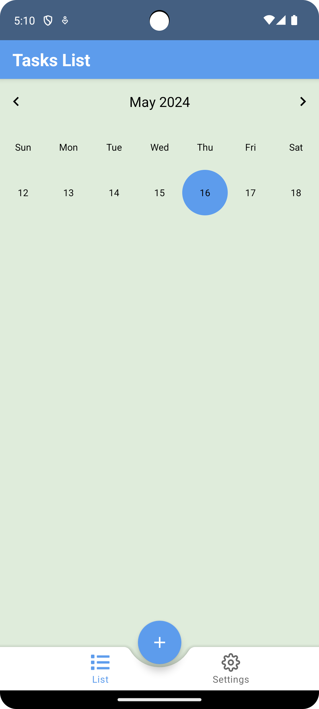
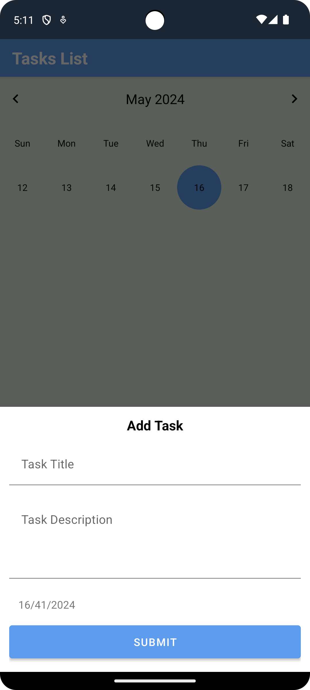
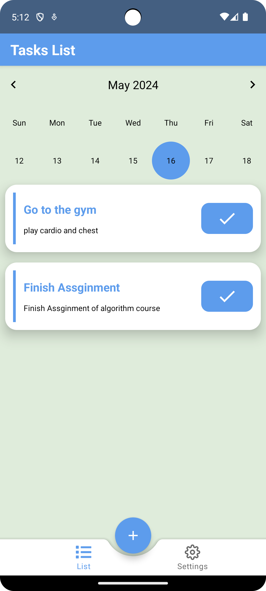

# Todo App

## Overview

The Todo App, built with Kotlin, is a simple yet powerful task management tool designed to help users organize their daily tasks and stay productive. With an intuitive user interface and essential features, the app enables users to create, manage, and prioritize tasks efficiently.

## Features

- **Task Creation:** Easily create new tasks with titles, descriptions, due dates, and priority levels.
- **Task Organization:** Categorize tasks into different lists or categories for better organization.
- **Task Prioritization:** Set priority levels (e.g., high, medium, low) to identify urgent tasks.
- **Task Completion:** Mark tasks as complete when finished to track progress and accomplishments.

## Technology Stack

- **Programming Language:** Kotlin
- **Database:** Room Persistence Library for local storage of tasks.
- **Development Tools:** Android Studio for development, Gradle for dependency management.

## Future Enhancements

- Integration with calendar apps for better scheduling and time management.
- Implementation of recurring tasks and task templates for repetitive tasks.
- Collaboration features for sharing tasks and lists with others.
- Integration with voice assistants for hands-free task management.

## Screenshots

| Screenshot 1 | Screenshot 2 | Screenshot 3 |
|---------------|---------------|---------------|
|  |  |  |

## Installation

1. Clone the repository:

git clone https://github.com/zeyad1910/todo.git

Copy code

2. Open the project in Android Studio.

3. Build and run the app on an Android device or emulator.

## Contributions

Contributions are welcome! Please feel free to submit issues or pull requests.
